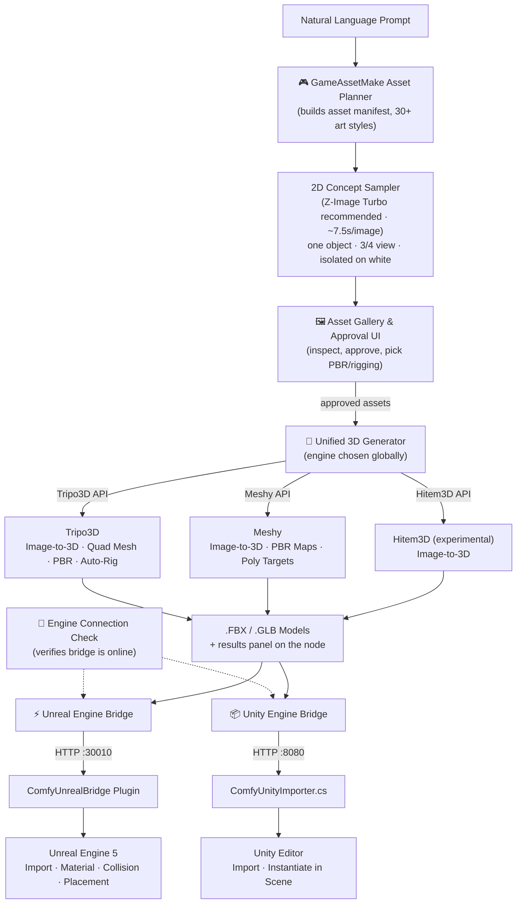

# 🎮 Geekatplay GameAssetMake

**AI-Powered 3D Game Asset Pipeline for ComfyUI → Unreal Engine 5 & Unity**

Created and maintained by **Vladimir Chopine** — [Geekatplay Studio](https://www.geekatplay.com)

[](https://github.com/GeekatplayStudio/ComfyUI-Geekatplay-GameAssetMake)
[](https://github.com/comfyanonymous/ComfyUI)
[](#-license)

---

## 📌 What This Is

**Geekatplay GameAssetMake** is a ComfyUI custom node pack that turns a plain-English game concept into a batch of finished, textured, rigged, and correctly-placed 3D **game assets** — not a game, an asset pipeline. Type something like:

> *"3D dungeon crawler with one hero, giant spiders, chests, wall torches, and stone pillars"*

...and the pipeline breaks it into a structured inventory of 10–50 individual assets (heroes, enemies, weapons, props, structures), generates one isolated concept image per asset, lets you review and approve them in an interactive gallery, sends the approved ones to **Tripo3D**, **Meshy**, or **Hitem3D** for image-to-3D generation (with PBR textures and auto-rigging), and finally delivers the finished `.FBX`/`.GLB` files straight into **Unreal Engine 5** or **Unity** — imported, materialed, collision-configured, and placed in your level/scene.

It does **not** generate gameplay logic, levels, or code — it makes the **assets** that go into your game.

---

## ✨ Key Features

- 🧠 **Natural-Language Asset Planner** — one prompt becomes a full manifest of game-ready assets with names, categories, scale, collision shape, and world placement.
- 🖼️ **Interactive Approval Gallery** — a native ComfyUI web widget to preview concept art, approve/reject per-asset, and pick 3D generation settings (engine, PBR, rigging) visually.
- 🧊 **Multiple Cloud 3D Backends** — generate meshes with **Tripo3D** (quad topology, PBR, biped/quadruped auto-rig), **Meshy** (PBR maps, poly-count targeting), or **Hitem3D** *(experimental)* — chosen globally on the 3D Generator node. A built-in results panel lists every model returned from the API with status and file path.
- 🎨 **30+ Art Styles** — from Low Poly, Voxel, and PS1 Retro through Realistic PBR, Dark Fantasy, Cyberpunk, Toon/Cel Shaded, Chibi, Claymation, and more. Concepts are generated one object per image, 3/4 view to the camera, isolated on white — the framing image-to-3D APIs handle best.
- 🔌 **Engine Connection Check** — a dedicated node (plus automatic pre-send verification in both bridges) confirms your Unreal/Unity editor bridge is installed, running, and reachable before you spend API credits.
- ⚡ **Unreal Engine 5 Bridge Plugin** — a droppable, C++-build-free plugin that listens on port `30010`, auto-imports FBX/GLB into `/Game/Assets/AI_Generated/`, builds materials, sets unit scale & collisions, and spawns actors into the active level.
- 📦 **Unity Editor Bridge** — a single-file Unity Editor script listening on port `8080` that imports models into `Assets/AI_Generated/` and instantiates them into the open scene, with automatic Unreal→Unity unit/axis conversion.
- 🧪 **Dry-Run Mock Mode** — test the entire pipeline end-to-end with zero API credits spent before going live.

---

## 🔄 How It Works



---

## 🛠️ Package Structure

```
ComfyUI-Geekatplay-GameAssetMake/
├── __init__.py                       # ComfyUI package entry point
├── README.md
├── nodes/
│   ├── __init__.py                   # Node registry
│   ├── game_planner_node.py          # 🎮 Asset Planner
│   ├── gallery_approval_node.py      # 🖼️ Gallery & Approval UI
│   ├── tripo_api.py                  # Tripo3D API client
│   ├── meshy_api.py                  # Meshy API client
│   ├── hitem3d_api.py                # Hitem3D API client (experimental)
│   ├── unified_3d_node.py            # 🧊 Unified 3D Generator
│   ├── unreal_bridge_node.py         # ⚡ Unreal Engine Bridge
│   ├── unity_bridge_node.py          # 📦 Unity Engine Bridge
│   └── engine_check_node.py          # 🔌 Engine Connection Check
├── web/
│   ├── js/gallery_widget.js          # Interactive gallery front-end
│   └── css/gallery.css               # Dark-mode styling
├── unreal_plugin/
│   └── ComfyUnrealBridge/            # Droppable Unreal Engine 5 plugin
│       ├── ComfyUnrealBridge.uplugin
│       └── Content/Python/
│           ├── init_unreal.py
│           ├── comfy_server.py
│           └── comfy_importer.py
├── unity_plugin/
│   └── ComfyUnityImporter.cs         # Unity Editor bridge script
└── workflows/                        # Ready-to-load example workflows
    ├── gameassetmake_unreal_tripo.json
    ├── gameassetmake_unreal_meshy.json
    ├── gameassetmake_unreal_hitem3d.json
    ├── gameassetmake_unity_tripo.json
    └── gameassetmake_unity_meshy.json
```

---

## 📦 Installation

### 1. Install the ComfyUI node pack

```bash
cd ComfyUI/custom_nodes/
git clone https://github.com/GeekatplayStudio/ComfyUI-Geekatplay-GameAssetMake.git
```

Restart ComfyUI. The nodes appear under the **Geekatplay GameAssetMake** category when you right-click → Add Node.

**Requirements:** ComfyUI with `Pillow` and `numpy` (already bundled with ComfyUI). No extra `pip install` needed for the ComfyUI side.

### 2. Install the Unreal Engine 5 plugin (optional — for UE5 delivery)

1. In your Unreal project root, create a `Plugins/` folder if it doesn't already exist.
2. Copy `unreal_plugin/ComfyUnrealBridge/` into `YourUnrealProject/Plugins/`, so you end up with:
   `YourUnrealProject/Plugins/ComfyUnrealBridge/ComfyUnrealBridge.uplugin`
3. Open (or restart) your Unreal Engine project.
4. Go to **Edit → Plugins** and confirm these are enabled:
   - **Python Editor Script Plugin**
   - **Editor Scripting Utilities**
   - **Geekatplay GameAssetMake Unreal Bridge**
5. Restart the editor if prompted. The bridge listener starts automatically — check the Output Log for:
   `[GameAssetMake Bridge] Listener server active on port 30010`

No C++ compilation is required — the plugin is pure Python + a `.uplugin` descriptor.

### 3. Install the Unity bridge (optional — for Unity delivery)

1. Copy `unity_plugin/ComfyUnityImporter.cs` into your Unity project, e.g. `Assets/Editor/ComfyUnityImporter.cs`.
2. Let Unity recompile. The bridge auto-starts; check the Console for:
   `[Geekatplay GameAssetMake] Unity bridge listening on port 8080...`
3. Imported assets land in `Assets/AI_Generated/` and are instantiated into the currently open scene when `auto_instantiate_in_scene` is enabled on the Unity Bridge node.

### 4. Get your API keys (optional — only needed for live generation)

- **Tripo3D**: sign up at [platform.tripo3d.ai](https://platform.tripo3d.ai/) and grab an API key.
- **Meshy**: sign up at [meshy.ai](https://www.meshy.ai/) and grab an API key.
- **Hitem3D** *(experimental)*: sign up at [hitem3d.ai](https://hitem3d.ai/) and grab an API key. Verify the endpoint in `nodes/hitem3d_api.py` matches your account's API documentation before going live.

Set them as environment variables before launching ComfyUI:

```bash
# Linux / macOS
export TRIPO_API_KEY="your_tripo_key"
export MESHY_API_KEY="your_meshy_key"
```

```powershell
# Windows PowerShell
$env:TRIPO_API_KEY = "your_tripo_key"
$env:MESHY_API_KEY = "your_meshy_key"
```

...or simply paste them into the **🧊 GameAssetMake 3D Generator** node's `tripo_api_key` / `meshy_api_key` fields. Until you add keys, leave `dry_run_mock` **ON** — the pipeline still runs end-to-end and produces placeholder mesh files so you can validate the workflow for free.

---

## 🚀 Quick Start with Example Workflows

The fastest way to try the pipeline: load one of the ready-made workflows from the [`workflows/`](workflows/) folder (**Workflow → Open** or drag the `.json` onto the canvas):

| Workflow | Engine | 3D Provider |
|---|---|---|
| `gameassetmake_unreal_tripo.json` | Unreal Engine 5 | Tripo3D |
| `gameassetmake_unreal_meshy.json` | Unreal Engine 5 | Meshy |
| `gameassetmake_unreal_hitem3d.json` | Unreal Engine 5 | Hitem3D *(experimental)* |
| `gameassetmake_unity_tripo.json` | Unity | Tripo3D |
| `gameassetmake_unity_meshy.json` | Unity | Meshy |

All five are preset to **Z-Image Turbo** (8 steps @ cfg 1.0) — benchmarked as the best fit for this job: ~7.5 s/image on an RTX 3090 versus ~27 s for `flux1-dev-fp8`, and the only model tested that reliably produced a single object isolated on pure white. It loads via three nodes (`UNETLoader` + `CLIPLoader` + `VAELoader`) rather than one checkpoint.

Then just: add your API key on the 3D Generator and queue. See [workflows/README.md](workflows/README.md) for the exact model files and how to swap in a different checkpoint.

---

## 🎮 Using the Pipeline

1. **Plan the assets** — add **🎮 GameAssetMake Asset Planner**, type your concept prompt, pick one of 30+ `art_style` presets, and set `target_asset_count`. It outputs `asset_manifest_json` and `prompt_list_json` — prompts are built for **one object per image, 3/4 view to the camera, isolated on pure white**.
2. **Generate 2D concepts** — feed `prompt_list_json` into a ComfyUI text-to-image sampler as a batch (**Z-Image Turbo recommended** — fast and the best at honoring "single object, isolated on white"), producing one concept image per asset.
3. **Review & approve** — connect the generated images and `asset_manifest_json` into **🖼️ GameAssetMake Asset Gallery & Approval UI**. Inspect each concept thumbnail, check the ones you want, toggle PBR texturing, and pick **Biped**/**Quadruped**/**None** rigging per asset. Click **Approve & Continue**. (The 3D provider — Tripo3D / Meshy / Hitem3D — is set globally on the 3D Generator node, not per asset.)
4. **Generate the 3D models** — wire `approved_assets_json` into **🧊 GameAssetMake 3D Generator**, pick your `engine`. It submits cloud tasks, polls for completion, downloads `.FBX`/`.GLB` files into `ComfyUI/output/3d_game_assets/`, and shows a results panel of every model returned by the API.
5. **Verify the engine bridge** — drop a **🔌 GameAssetMake Engine Connection Check** node (or just rely on the bridge nodes' own pre-send check) to confirm Unreal/Unity is running and reachable before sending assets.
6. **Deliver to your engine** — connect `completed_3d_manifest_json` to:
   - **⚡ Unreal Engine Bridge** (talks to `unreal_host:unreal_port`, default `127.0.0.1:30010`), and/or
   - **📦 Unity Engine Bridge** (talks to `unity_host:unity_port`, default `127.0.0.1:8080`).
7. **Watch it land** — switch to your engine editor: models are imported, PBR materials built, collisions configured, unit scale applied, and actors/prefabs placed at the manifest's world coordinates.

---

## 🧯 Troubleshooting

| Symptom | Fix |
|---|---|
| Bridge shows OFFLINE on the Connection Check node | Confirm the target editor (Unreal or Unity) is actually open with the plugin/script installed and enabled; check `host`/`port` match; a firewall may be blocking localhost traffic. |
| Unreal never receives assets | Confirm the Output Log shows the bridge listener started on `30010`; check the plugin is enabled under Edit → Plugins; make sure ComfyUI and Unreal are on the same host or set `unreal_host` correctly. |
| Unity never receives assets | Port `8080` may already be in use — change `Port` in `ComfyUnityImporter.cs` and `unity_port` on the node to match; confirm the Console shows the listener started. |
| Nodes don't show up in ComfyUI | Confirm the folder is directly inside `custom_nodes/` (not nested one level deeper) and restart ComfyUI; check the console for import errors. |
| Live API calls fail | Check the `generation_status` field per asset in the 3D Generator's output manifest — failures are recorded per-asset without stopping the rest of the batch. Verify your API key and account credit balance. |
| Gallery images don't display | Make sure the upstream 2D sampler batch size matches (or exceeds) `target_asset_count`; images are cycled if fewer are supplied than assets. |

---

## 🗺️ Roadmap

- [ ] Additional 3D backends (Rodin, Hunyuan3D) — Hitem3D added (experimental)
- [ ] Verify/finalize the Hitem3D endpoint against official API docs
- [ ] In-gallery per-asset prompt re-roll
- [ ] Direct Unreal Remote Control API material graph customization
- [ ] Unity Addressables export mode

---

## 🤝 Contributing

Issues and pull requests are welcome at
[github.com/GeekatplayStudio/ComfyUI-Geekatplay-GameAssetMake](https://github.com/GeekatplayStudio/ComfyUI-Geekatplay-GameAssetMake).

## 📄 License

MIT License — see [LICENSE](LICENSE).

---

**© Geekatplay Studio — Vladimir Chopine.** [geekatplay.com](https://www.geekatplay.com)
