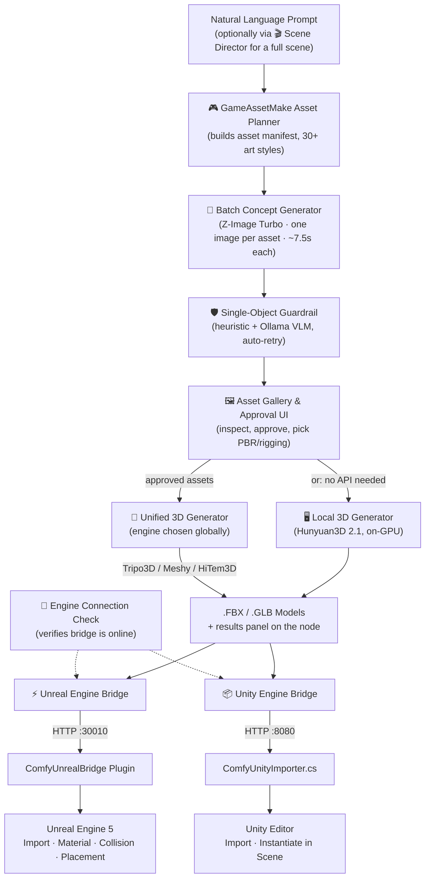

# 🎮 Geekatplay GameAssetMake

**AI-Powered 3D Game Asset Pipeline for ComfyUI → Unreal Engine 5 & Unity**

Created and maintained by **Vladimir Chopine** — [Geekatplay Studio](https://www.geekatplay.com)

[](https://github.com/GeekatplayStudio/ComfyUI-Geekatplay-GameAssetMake)
[](https://github.com/comfyanonymous/ComfyUI)
[](#-license)

---

## 📌 What This Is

**Geekatplay GameAssetMake** is a ComfyUI custom node pack that turns a plain-English game concept into a batch of finished, textured, rigged, and correctly-placed 3D **game assets** — not a game, an asset pipeline. Type something like:

> *"3D dungeon crawler with one hero, giant spiders, chests, wall torches, and stone pillars"*

...and the pipeline breaks it into a structured inventory of 10–50 individual assets (heroes, enemies, weapons, props, structures), generates one isolated concept image per asset, lets you review and approve them in an interactive gallery, sends the approved ones to **Tripo3D**, **Meshy**, or **Hitem3D** for image-to-3D generation (with PBR textures and auto-rigging), and finally delivers the finished `.FBX`/`.GLB` files straight into **Unreal Engine 5** or **Unity** — imported, materialed, collision-configured, and placed in your level/scene.

It does **not** generate gameplay logic, levels, or code — it makes the **assets** that go into your game.

---

## ✨ Key Features

- 🎬 **Full Scene From One Prompt** — the Scene Director node turns *"medieval village at sunset in winter"* into a coordinated plan: positioned asset layout (meters + rotations, planned by a local Ollama LLM with a deterministic fallback), seasonal terrain texture baked onto a real walkable terrain mesh, a matching skydome, and the **sun position computed for that season and time of day** — set as a DirectionalLight in Unreal automatically. A 🗺️ Layout Map node renders the whole plan as a top-down coordinate map (with sun compass) so you can verify placement before generating anything.
- 🧠 **Natural-Language Asset Planner** — one prompt becomes a full manifest of game-ready assets with names, categories, scale, collision shape, and world placement.
- 🖼️ **Interactive Approval Gallery** — a native ComfyUI web widget to preview concept art, approve/reject per-asset, and pick 3D generation settings (engine, PBR, rigging) visually.
- 🧊 **Multiple 3D Backends, cloud or local** — cloud: **Tripo3D** (quad topology, PBR, biped/quadruped auto-rig), **Meshy** (PBR maps, poly-count targeting), or **HiTem3D**, chosen globally on the 3D Generator. Local: **Hunyuan3D 2.1** runs entirely on your own GPU — no API, no keys, no credits, nothing uploaded. Both paths feed the same engine bridges and show a results panel listing every generated model.
- 🎨 **30+ Art Styles** — from Low Poly, Voxel, and PS1 Retro through Realistic PBR, Dark Fantasy, Cyberpunk, Toon/Cel Shaded, Chibi, Claymation, and more. Concepts are generated one object per image, 3/4 view to the camera, isolated on white — the framing image-to-3D APIs handle best.
- 📐 **Placement Manager** — the single authority for engine delivery: imports in the right order (terrain → sky → assets), normalizes every AI mesh to its intended real-world size by measuring its actual bounds in the engine, snaps asset Z onto the terrain heightfield, and nudges overlapping assets apart. One failing asset no longer aborts the batch.
- 🔌 **Engine Connection Check** — a dedicated node (plus automatic pre-send verification in both bridges) confirms your Unreal/Unity editor bridge is installed, running, and reachable before you spend API credits.
- ⚡ **Unreal Engine 5 Bridge Plugin** — a droppable, C++-build-free plugin that listens on port `30010`, auto-imports FBX/GLB into `/Game/Assets/AI_Generated/`, builds materials, sets unit scale & collisions, and spawns actors into the active level.
- 📦 **Unity Editor Bridge** — a single-file Unity Editor script listening on port `8080` that imports models into `Assets/AI_Generated/` and instantiates them into the open scene, with automatic Unreal→Unity unit/axis conversion.
- 🧪 **Dry-Run Mock Mode** — test the entire pipeline end-to-end with zero API credits spent before going live.

---

## 🔄 How It Works



---

## 🛠️ Package Structure

```
ComfyUI-Geekatplay-GameAssetMake/
├── __init__.py                       # ComfyUI package entry point
├── README.md
├── nodes/
│   ├── __init__.py                   # Node registry
│   ├── game_planner_node.py          # 🎮 Asset Planner
│   ├── gallery_approval_node.py      # 🖼️ Gallery & Approval UI
│   ├── tripo_api.py                  # Tripo3D API client
│   ├── meshy_api.py                  # Meshy API client
│   ├── hitem3d_api.py                # HiTem3D API client (two-key auth)
│   ├── keystore.py                   # 🔑 Secure key storage (OS credential vault)
│   ├── batch_concept_node.py         # 🔁 Batch Concept Generator (one image per asset)
│   ├── asset_verify_node.py          # 🛡️ Single-Object Guardrail (VLM + auto-retry)
│   ├── environment_export_node.py    # 🌍 Terrain/Skydome/Texture export
│   ├── unified_3d_node.py            # 🧊 Unified 3D Generator (cloud APIs)
│   ├── local_hunyuan3d_node.py       # 🖥️ Local 3D Generator (Hunyuan3D 2.1)
│   ├── scene_director_node.py        # 🎬 Scene Director (prompt → scene plan + sun/season)
│   ├── layout_map_node.py            # 🗺️ Layout Map (top-down placement preview)
│   ├── placement_manager_node.py     # 📐 Placement Manager (order, true scale, terrain snap)
│   ├── terrain_mesh_node.py          # ⛰️ Terrain Mesh Builder (heightmap → mesh)
│   ├── unreal_bridge_node.py         # ⚡ Unreal Engine Bridge
│   ├── unity_bridge_node.py          # 📦 Unity Engine Bridge
│   └── engine_check_node.py          # 🔌 Engine Connection Check
├── web/
│   ├── js/gallery_widget.js          # Interactive gallery front-end
│   └── css/gallery.css               # Dark-mode styling
├── unreal_plugin/
│   └── ComfyUnrealBridge/            # Droppable Unreal Engine 5 plugin
│       ├── ComfyUnrealBridge.uplugin
│       └── Content/Python/
│           ├── init_unreal.py
│           ├── comfy_server.py
│           └── comfy_importer.py
├── unity_plugin/
│   └── ComfyUnityImporter.cs         # Unity Editor bridge script
├── workflows/                         # Ready-to-load workflows
│   ├── gameassetmake_unreal.json     # Universal 3D asset pipeline → UE5
│   ├── gameassetmake_unity.json      # Universal 3D asset pipeline → Unity
│   ├── gameassetmake_terrain.json    # Terrain heightmap from description
│   ├── gameassetmake_skydome.json    # 360° skydome HDRI
│   ├── gameassetmake_textures.json   # Seamless PBR materials
│   ├── gameassetmake_local_hunyuan3d_unreal.json  # Local 3D (no API) → UE5
│   ├── gameassetmake_local_hunyuan3d_unity.json   # Local 3D (no API) → Unity
│   └── gameassetmake_full_scene_unreal.json       # 🎬 Full scene from one prompt
└── tools/
    └── validate_workflows.py         # Connection validator (run after editing workflows)
```

---

## 📦 Installation

### 1. Install the ComfyUI node pack

```bash
cd ComfyUI/custom_nodes/
git clone https://github.com/GeekatplayStudio/ComfyUI-Geekatplay-GameAssetMake.git
```

Restart ComfyUI. The nodes appear under the **Geekatplay GameAssetMake** category when you right-click → Add Node.

**Requirements:** ComfyUI with `Pillow` and `numpy` (already bundled with ComfyUI). No extra `pip install` needed for the ComfyUI side.

### 2. Install the Unreal Engine 5 plugin (optional — for UE5 delivery)

1. In your Unreal project root, create a `Plugins/` folder if it doesn't already exist.
2. Copy `unreal_plugin/ComfyUnrealBridge/` into `YourUnrealProject/Plugins/`, so you end up with:
   `YourUnrealProject/Plugins/ComfyUnrealBridge/ComfyUnrealBridge.uplugin`
3. Open (or restart) your Unreal Engine project.
4. Go to **Edit → Plugins** and confirm these are enabled:
   - **Python Editor Script Plugin**
   - **Editor Scripting Utilities**
   - **Geekatplay GameAssetMake Unreal Bridge**
5. Restart the editor if prompted. The bridge listener starts automatically — check the Output Log for:
   `[GameAssetMake Bridge] Listener server active on port 30010`

No C++ compilation is required — the plugin is pure Python + a `.uplugin` descriptor.

### 3. Install the Unity bridge (optional — for Unity delivery)

1. Copy `unity_plugin/ComfyUnityImporter.cs` into your Unity project, e.g. `Assets/Editor/ComfyUnityImporter.cs`.
2. Let Unity recompile. The bridge auto-starts; check the Console for:
   `[Geekatplay GameAssetMake] Unity bridge listening on port 8080...`
3. Imported assets land in `Assets/AI_Generated/` and are instantiated into the currently open scene when `auto_instantiate_in_scene` is enabled on the Unity Bridge node.

### 4. Get your API keys (optional — only needed for live generation)

- **Tripo3D**: sign up at [platform.tripo3d.ai](https://platform.tripo3d.ai/) and grab an API key.
- **Meshy**: sign up at [meshy.ai](https://www.meshy.ai/) and grab an API key.
- **HiTem3D**: sign up at [hitem3d.ai](https://hitem3d.ai/) and generate an API Key, which comes as an **AK/SK pair** — an Access Key (`ak_...`, the Client ID) and a Secret Key (`sk_...`, the Client Secret). Enter **both** in the 3D Generator's separate `hitem3d_access_key` / `hitem3d_secret_key` fields. The key must be in "Enabled" status to work. See the [HiTem3D API docs](https://docs.hi3d.ai/en/api/getting-started/quickstart).

Set them as environment variables before launching ComfyUI:

```bash
# Linux / macOS
export TRIPO_API_KEY="your_tripo_key"
export MESHY_API_KEY="your_meshy_key"
```

```powershell
# Windows PowerShell
$env:TRIPO_API_KEY = "your_tripo_key"
$env:MESHY_API_KEY = "your_meshy_key"
```

...or simply paste them into the **🧊 GameAssetMake 3D Generator** node's `tripo_api_key` / `meshy_api_key` fields (HiTem3D: `hitem3d_access_key` + `hitem3d_secret_key`, both required). Typed keys are saved to the OS credential vault automatically (`remember_keys` is on by default) — enter each one once and every workflow picks it up from then on, nothing is stored in workflow JSON. Until you add keys, leave `dry_run_mock` **ON** — the pipeline still runs end-to-end and produces placeholder mesh files so you can validate the workflow for free (the engine bridges automatically refuse to ship these placeholders into Unreal/Unity).

### 5. Optional: local 3D generation (no API keys, no credits)

Download [`hunyuan_3d_v2.1.safetensors`](https://huggingface.co/Comfy-Org/hunyuan3D_2.1_repackaged/resolve/main/hunyuan_3d_v2.1.safetensors) (~7.4 GB) into `ComfyUI/models/checkpoints/` to use the `gameassetmake_local_hunyuan3d_*` workflows — 3D meshes are then generated entirely on your own GPU, nothing uploaded, no account needed.

### 6. Optional: Ollama for the Single-Object Guardrail and Scene Director

The 🛡️ guardrail's VLM check and the 🎬 Scene Director's layout planning use a local [Ollama](https://ollama.com) server (`http://127.0.0.1:11434` by default, model `gemma3`/`qwen2.5:7b`). Both fall back automatically — the guardrail to a heuristic-only check, the Scene Director to a deterministic seeded layout — so Ollama is optional, not required.

---

## 🚀 Quick Start with Example Workflows

The fastest way to try the pipeline: load one of the ready-made workflows from the [`workflows/`](workflows/) folder (**Workflow → Open** or drag the `.json` onto the canvas):

| Workflow | What it makes | Engine |
|---|---|---|
| `gameassetmake_unreal.json` | **Universal 3D asset pipeline** (pick Tripo3D / Meshy / HiTem3D on the 3D Generator) | Unreal Engine 5 |
| `gameassetmake_unity.json` | Same universal pipeline | Unity |
| `gameassetmake_terrain.json` | Terrain heightmap from description (16-bit PNG) | Unreal Engine 5 |
| `gameassetmake_skydome.json` | 360° skydome HDRI (.exr, seam-healed) | Unreal Engine 5 |
| `gameassetmake_textures.json` | Seamless PBR material set (albedo/normal/roughness/metallic) | Unreal Engine 5 |
| `gameassetmake_local_hunyuan3d_unreal.json` | **Fully local 3D** via Hunyuan3D 2.1 — no API, no keys, no credits | Unreal Engine 5 |
| `gameassetmake_local_hunyuan3d_unity.json` | Same, fully local | Unity |
| `gameassetmake_full_scene_unreal.json` | 🎬 **Full scene from one prompt** — terrain + sky + placed assets, with approval stop | Unreal Engine 5 |

Together: **full game assets from a single prompt** — 3D models, terrain, sky, and materials. All preset to **Z-Image Turbo** (8 steps @ cfg 1.0) — benchmarked as the best fit for this job: ~7.5 s/image on an RTX 3090 versus ~27 s for `flux1-dev-fp8`, and the only model tested that reliably produced a single object isolated on pure white.

The universal workflows use the **🔁 Batch Concept Generator**, which loops over the planner's prompts and renders **one image per asset** (each with its own seed), then verifies each is a single object on white — one human/animal for rigged characters — regenerating failures automatically before you ever see them.

**API keys are entered once and stored in the OS credential vault** (Windows Credential Manager / macOS Keychain) — never in workflow JSON, so sharing a workflow never leaks a key. HiTem3D issues an AK/SK pair, so it has **two separate fields**: `hitem3d_access_key` (`ak_...`) and `hitem3d_secret_key` (`sk_...`). The terrain/skydome/texture workflows use nodes from the companion [ComfyUI-Blender-Toolbox](https://github.com/GeekatplayStudio/ComfyUI_Blender_toolbox) pack (same author) — install both. See [workflows/README.md](workflows/README.md) for details.

---

## 🎮 Using the Pipeline

1. **Plan the assets** — add **🎮 GameAssetMake Asset Planner**, type your concept prompt, pick one of 30+ `art_style` presets, and set `target_asset_count`. It outputs `asset_manifest_json` and `prompt_list_json` — prompts are built for **one object per image, 3/4 view to the camera, isolated on pure white**.
2. **Generate 2D concepts** — feed `prompt_list_json` into the **🔁 Batch Concept Generator**, which loops over the prompts and renders one image per asset with per-item verification (**Z-Image Turbo recommended** — fast and the best at honoring "single object, isolated on white"). Don't wire the prompt list straight into a `CLIPTextEncode`: that collapses every asset into one prompt and every image then contains everything.
3. **Review & approve** — connect the generated images and `asset_manifest_json` into **🖼️ GameAssetMake Asset Gallery & Approval UI**. Inspect each concept thumbnail, check the ones you want, toggle PBR texturing, and pick **Biped**/**Quadruped**/**None** rigging per asset. Click **Approve & Continue**. (The 3D provider — Tripo3D / Meshy / Hitem3D — is set globally on the 3D Generator node, not per asset.)
4. **Generate the 3D models** — wire `approved_assets_json` into **🧊 GameAssetMake 3D Generator**, pick your `engine`. It submits cloud tasks, polls for completion, downloads `.FBX`/`.GLB` files into `ComfyUI/output/3d_game_assets/`, and shows a results panel of every model returned by the API.
5. **Verify the engine bridge** — drop a **🔌 GameAssetMake Engine Connection Check** node (or just rely on the bridge nodes' own pre-send check) to confirm Unreal/Unity is running and reachable before sending assets.
6. **Deliver to your engine** — connect `completed_3d_manifest_json` to:
   - **⚡ Unreal Engine Bridge** (talks to `unreal_host:unreal_port`, default `127.0.0.1:30010`), and/or
   - **📦 Unity Engine Bridge** (talks to `unity_host:unity_port`, default `127.0.0.1:8080`).
7. **Watch it land** — switch to your engine editor: models are imported, PBR materials built, collisions configured, unit scale applied, and actors/prefabs placed at the manifest's world coordinates.

---

## 🧯 Troubleshooting

| Symptom | Fix |
|---|---|
| Bridge shows OFFLINE on the Connection Check node | Confirm the target editor (Unreal or Unity) is actually open with the plugin/script installed and enabled; check `host`/`port` match; a firewall may be blocking localhost traffic. |
| Unreal never receives assets | Confirm the Output Log shows the bridge listener started on `30010`; check the plugin is enabled under Edit → Plugins; make sure ComfyUI and Unreal are on the same host or set `unreal_host` correctly. After editing/updating the plugin files, **restart the Unreal Editor** — its Python modules are cached and won't pick up changes otherwise. |
| Unity never receives assets | Port `8080` may already be in use — change `Port` in `ComfyUnityImporter.cs` and `unity_port` on the node to match; confirm the Console shows the listener started. |
| `.glb` assets import but nothing appears in the Unity scene | Unity has no built-in glTF importer. Install **glTFast** (`com.unity.cloud.gltfast`) or **UnityGLTF**, or set the 3D Generator's `output_format` to `FBX` instead. |
| Nothing lands in the engine even though the run "succeeded" | Check the console for `"Skipping N asset(s) that are not real meshes"` — this means `dry_run_mock` was left ON, so every model was a placeholder stub; the bridges refuse to ship those. Turn `dry_run_mock` off (or use a local Hunyuan3D workflow). |
| Every generated 3D model looks identical | The number of concept images must equal the number of manifest assets — use the 🔁 Batch Concept Generator (which renders one image per asset) rather than a single `CLIPTextEncode`/`KSampler` feeding a batch; a count mismatch is now reported loudly in the console instead of silently reusing one image. |
| Nodes don't show up in ComfyUI | Confirm the folder is directly inside `custom_nodes/` (not nested one level deeper) and restart ComfyUI; check the console for import errors. |
| Live API calls fail | Check the `generation_status` field per asset in the 3D Generator's output manifest — failures are recorded per-asset without stopping the rest of the batch. Verify your API key and account credit balance. |
| Gallery images don't display | Make sure the upstream 2D sampler batch size matches (or exceeds) `target_asset_count`; a mismatch is now logged and any assets without an image are skipped rather than reusing an existing one. |
| A workflow won't load or a node reports missing inputs after an edit | Run `python tools/validate_workflows.py` (with ComfyUI running) — it checks every workflow's links, required inputs, and widget counts against the live node definitions and reports exactly what's wrong. |

---

## 🗺️ Roadmap

- [x] Local 3D generation with Hunyuan3D 2.1 (no API/keys/credits)
- [x] Full scene from one prompt (Scene Director: terrain + skydome + positioned assets)
- [x] Terrain as a real walkable mesh (not just a heightmap texture)
- [x] HiTem3D live-verified with correct two-key (AK/SK) auth
- [ ] Additional cloud 3D backends (Rodin)
- [ ] Native Unreal Landscape creation (currently: mesh terrain + optional manual Landscape import)
- [ ] In-gallery per-asset prompt re-roll
- [ ] Direct Unreal Remote Control API material graph customization
- [ ] Unity Addressables export mode

---

## 🤝 Contributing

Issues and pull requests are welcome at
[github.com/GeekatplayStudio/ComfyUI-Geekatplay-GameAssetMake](https://github.com/GeekatplayStudio/ComfyUI-Geekatplay-GameAssetMake).

## 📄 License

MIT License — see [LICENSE](LICENSE).

---

**© Geekatplay Studio — Vladimir Chopine.** [geekatplay.com](https://www.geekatplay.com)
