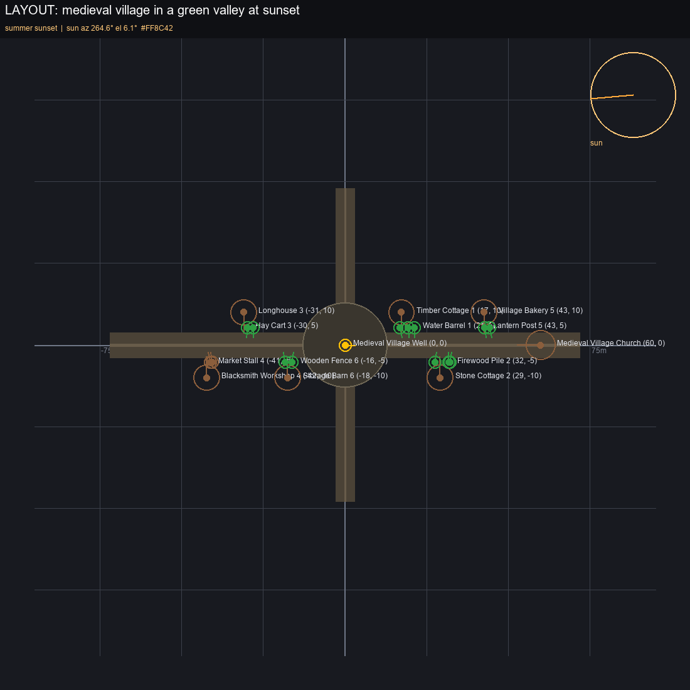
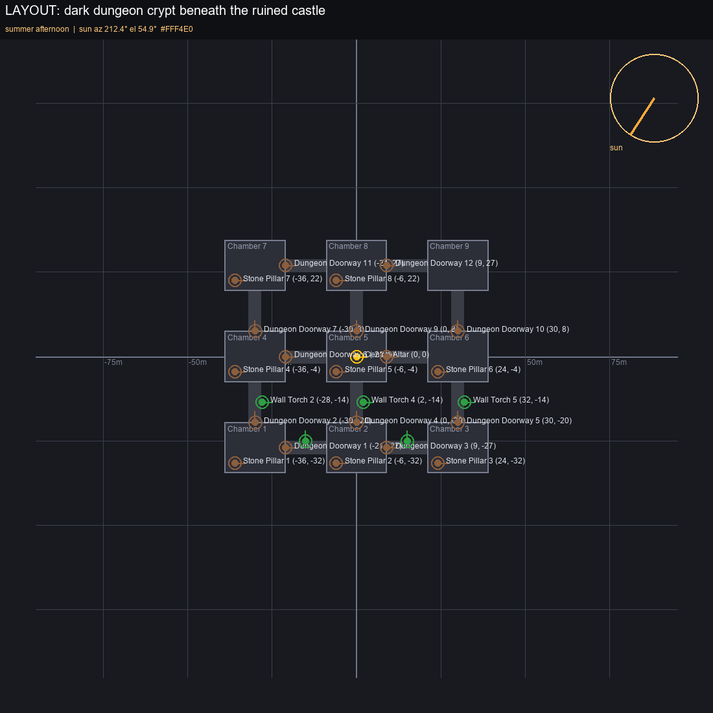
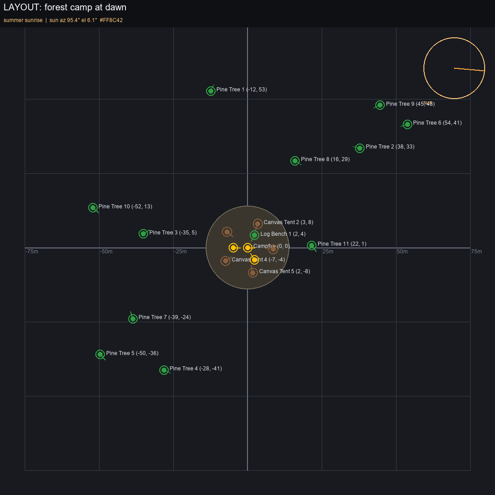
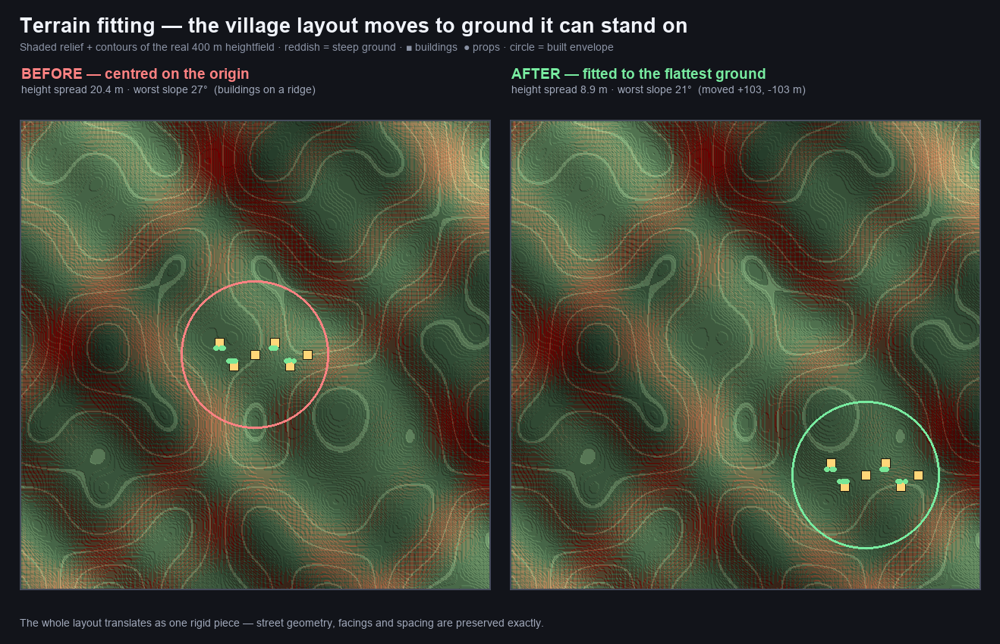

# 📂 Workflows — Geekatplay GameAssetMake

Ready-to-load ComfyUI workflows by **Geekatplay Studio — Vladimir Chopine**.
Load via **Workflow → Open** or drag the `.json` onto the canvas.

**Full game assets from a single prompt** — models, terrain, skydome, and materials:

| Workflow | What it makes | Engine delivery |
|---|---|---|
| `gameassetmake_unreal.json` | **Universal 3D asset pipeline** — planner → concepts → guardrail → gallery → 3D models | Unreal Engine 5 (:30010) |
| `gameassetmake_unity.json` | Same universal pipeline | Unity (:8080) |
| `gameassetmake_terrain.json` / `_unity.json` | **Walkable terrain mesh** from a description — heightmap + matching ground texture, imported and placed | UE5 / Unity |
| `gameassetmake_skydome.json` / `_unity.json` | **360° skydome HDRI** — set up as a sky sphere (UE) or scene skybox (Unity) | UE5 / Unity |
| `gameassetmake_textures.json` | **Seamless PBR material** (albedo + normal + roughness + metallic) | Unreal Engine 5 |
| `gameassetmake_local_hunyuan3d_unreal.json` | **Fully local 3D** — Hunyuan3D 2.1 on your GPU, no API/keys/credits | Unreal Engine 5 |
| `gameassetmake_local_hunyuan3d_unity.json` | Same, fully local | Unity |
| `gameassetmake_full_scene_unreal.json` | 🎬 **FULL SCENE from one prompt** — terrain mesh + skydome + positioned assets | Unreal Engine 5 |
| `gameassetmake_image_to_assetpack_unreal.json` / `_unity.json` | ✂️ **ONE IMAGE → whole asset pack** — every object extracted, approved, meshed, placed like the picture. Needs **no diffusion models** | UE5 / Unity |
| `gameassetmake_styled_multiview_unreal.json` | 🎨🔄 Universal pipeline + **moodboard style lock** + **front/left/right/back turnaround** per approved asset | Unreal Engine 5 |

## 🎬 Full scene from one prompt

Type *"medieval village in a green valley"* into the **Scene Director** node and queue. It plans the whole scene — using a local Ollama LLM (`qwen2.5:7b` by default) for deep layout analysis, with a deterministic seeded layout engine as fallback — and drives three parallel branches:

1. **Terrain** — the director's terrain brief → heightmap generation → **Terrain Mesh Builder** turns it into a real displaced, UV-mapped mesh (.glb) at true world size, imported into Unreal as a walkable static mesh placed at the origin. A 16-bit heightmap PNG is exported alongside for a native `Mode → Landscape → Import` if you prefer a real Landscape.
2. **Skydome** — the director's sky brief → 2:1 panorama → seam heal → HDRI (.exr) → in Unreal, an **unlit emissive sky sphere is created automatically** (material built from the imported texture, applied to an inverted 800m dome).
3. **Assets** — the director emits a positioned asset list (world x/y in meters, rotation yaw, per-asset scale — houses ring the well facing center, church at the edge, props scattered logically) that feeds the existing planner → per-asset concepts → **Gallery approval stop** (reject and re-queue until you like the set) → 3D generation → placed in Unreal at the exact layout coordinates and rotations.

The gallery is the human-in-the-loop stop: nothing is spent on 3D generation until you approve. Re-queue with a different seed to redo any branch.

### 🎨 Terrain textures derived from the heightfield

The terrain colour map is generated **from the heightmap itself**, not from a separate text prompt — the two-step "heightmap → matching texture" approach from the author's [ai-terrain](https://github.com/GeekatplayStudio/ai-terrain) project, done locally so alignment is exact rather than approximate:

- **Elevation bands** — water → shore → grass → upland → rock → snow, with **season palettes** (summer/spring/autumn/winter).
- **Slope-aware rock** — steep faces become bare rock; snow settles on flat high ground and sheds off cliffs.
- **Area equalization** (`equalize`, default 0.8) — generated heightmaps are shaded reliefs with skewed histograms, so bands are spread by *area* instead of raw brightness. Without this, an absolute snow line turns half the map into a glacier.
- **Optional tileable detail** — the generated PBR material can be multiplied over the top for surface grain without breaking alignment.

**Full PBR, not just colour.** The node outputs **albedo + normal + roughness + AO**:

- **Normal map** is computed from the *actual heightfield* — mathematically exact, not inferred from a photo the way image-based extractors must. Choose **DirectX (Unreal)** or **OpenGL (Unity/glTF)** green-channel convention.
- **Roughness** varies per material band (water smooth, rock and grass rough, snow softer).
- **AO** comes from local cavity in the heightfield, darkening creases and valleys.

All four maps are exported next to the mesh (`_color`, `_normal`, `_roughness`, `_ao`). The engine importer builds an explicit **PBR material** and applies it to the terrain actor — the same pattern the skydome uses, because glTF import pipelines don't reliably surface embedded textures. Crucially it also sets the **texture settings correctly**: normal/roughness/AO are imported as *data* (sRGB off, normal-map compression), which is the classic mistake that makes PBR look wrong.

**Optional: Ubisoft CHORD** for photo→PBR on tileable materials (not terrain — terrain has the real heightfield, which is better). It's a gated model: accept the licence at [huggingface.co/Ubisoft/ubisoft-laforge-chord](https://huggingface.co/Ubisoft/ubisoft-laforge-chord), then place `chord_v1.safetensors` in `ComfyUI/models/ubsoft_pbr/`. The companion Blender-Toolbox's **PBR Extractor** node then produces albedo/normal/roughness/metallic/depth from any image, and falls back to a procedural estimate when the model isn't installed.

### 🔍 High-resolution terrain

Generated heightmaps come out of the diffusion model at ~1024px, which is far too coarse once it is stretched over hundreds of metres. The **🔍 Terrain Upscaler** raises it to game-engine resolution before anything else is derived from it:

- **Lanczos resampling** — properly antialiased, no stair-stepping.
- **Slope-masked fractal detail** — multi-octave micro-relief added *on slopes*, leaving valleys and plateaus smooth. This is what turns a 4× upscale into actual detail rather than a bigger blur.
- **AI model path (optional)** — connect an `UPSCALE_MODEL` (4x-UltraSharp, RealESRGAN…) if you want its detail. Height data is not an image, so an ESRGAN's invented high-frequency texture becomes *spikes* in the mesh; the node therefore low-passes the result automatically. **Lanczos + fractal is the recommended default for geometry.**
- Output is capped at **8192px**, the practical ceiling for engine textures and Unreal landscape sizes.

Because everything downstream is derived from the upscaled heightfield, the colour, normal, roughness and AO maps all gain the same resolution. Defaults are now **4× upscale → 4096² PBR maps → 512² mesh grid** (523k tris). The **16-bit heightmap is exported at the full upscaled resolution** (not the mesh grid), so it is directly usable for a native `Mode → Landscape → Import from File`.

Detail mostly comes from the **normal map**, so raise the texture resolution before pushing the mesh grid very high — a 4096² normal map on a 512² grid looks far better than the reverse and costs a fraction of the triangles.

### ☀️ Lighting in every workflow

Every workflow that delivers to an engine includes a light source, because assets imported into a level with no light render black:

- The **☀️ Sun / Environment** node (season + time of day, or manual azimuth/elevation) feeds `environment_json` to the bridge, which configures a **DirectionalLight** in Unreal or Unity.
- Skydome workflows additionally build the sky itself: an **unlit emissive sky sphere** plus a **SkyLight** capturing it in Unreal (so the HDRI provides image-based ambient light), or `RenderSettings.skybox` in Unity.
- The full-scene workflow gets its sun from the **Scene Director** instead, so the light matches the season and hour in your prompt.

### 🎚️ Import-only vs. import + scene setup

Every exporter — Unreal **and** Unity — has one master toggle:

| Toggle | Unreal (`auto_place_in_level`) | Unity (`auto_instantiate_in_scene`) |
|---|---|---|
| **Import + Set Up In Scene** | meshes spawned at their coordinates, terrain placed and size-verified, **skydome built as an emissive sky sphere**, sun DirectionalLight configured | prefabs instantiated, terrain placed, **skydome assigned as the scene skybox** (`RenderSettings.skybox`, panoramic material), sun directional light configured |
| **Import As Assets Only** | everything lands in `/Game/Assets/AI_Generated/` — nothing touches your level | everything lands in `Assets/AI_Generated/` — nothing touches your scene |

This applies to **all** asset kinds: objects, terrain, and skydome. The terrain and skydome workflows now route through the Placement Manager and a real bridge, so they import *and* set up exactly like the asset workflows do.

### 📐 Placement Manager — sizes and positions that actually match

Every delivery now flows through the **Placement Manager** node, the single authority for what enters the engine:

- **Order** — terrain imports first, then the skydome, then assets, in one payload through one bridge node.
- **True scale** — AI-generated meshes arrive in random units. Each asset carries `target_size_m` (its intended real-world size); the engine importer *measures the imported mesh's bounds* and scales it to match exactly, then verifies the terrain's world size the same way. No more 100× surprises.
- **Terrain snapping** — asset Z is sampled from the terrain's 16-bit heightfield, so buildings sit ON hills instead of floating or sinking; the mesh *bottom* is grounded, not its pivot.
- **Overlap resolution** — assets planned too close are nudged apart automatically.
- One failed asset no longer aborts the batch — the Unreal importer isolates errors per asset and reports which ones failed at the end.

### 🗺️ Layout map & 🌦️ season/time intelligence

- The **Layout Map** node renders the director's plan as a visible top-down map: meter grid, one marker per asset with name + (x, y) coordinates, facing arrows, and a sun compass — verify the placement *before* generating anything.
- The prompt drives the **environment**: say *"medieval village at sunset in winter"* and the director detects season + time of day, then: the terrain's ground texture prompt becomes seasonal (snow on peaks, frozen paths — baked onto the terrain mesh), the skydome prompt becomes a winter sunset sky, and the **sun position is computed for that season and hour** (winter sunset ≈ azimuth 265°, elevation 2°, warm orange). The Unreal bridge carries this as `environment_json`, and the plugin **sets a DirectionalLight in the level** to match — imported terrain, sky, and lighting all agree.
- Ground-texture-to-terrain pairing follows the two-step approach from the author's [ai-terrain](https://github.com/GeekatplayStudio/ai-terrain) project: texture generated to match the terrain description and elevation zones, then baked into the terrain `.glb` with matching UVs.

The 3D provider (**Tripo3D / Meshy / HiTem3D**) is one global `engine` choice on the 3D Generator node — no more per-provider workflow duplicates. Unity delivery for terrain/skydome/textures: swap the bridge node for the Unity one.

## ✂️ One image → whole asset pack

The `image_to_assetpack` workflows start from a **picture instead of a prompt**: load one
environment image (a concept painting, a screenshot of a game you like, an AI render) and
the **✂️ Scene Element Extractor** mines it for every distinct object — buildings, benches,
street lamps, crates — cutting each onto the clean white square the image-to-3D APIs
require and writing a normal asset manifest. From there it is the standard chain:
gallery approval stop → 3D generation → Placement Manager → engine bridge. This path
needs **no diffusion models at all** — nothing is rendered, only detected and cropped.

Extractor properties, and when to touch them:

| Property | Default | What it does |
|---|---|---|
| `max_assets` | 12 | Cap on extracted objects. |
| `min_object_area_pct` | 0.5 | Detections below this % of the image are noise. Raise to reduce clutter, lower to catch small props. |
| `crop_padding_pct` | 8 | Margin around each detection box so tight boxes don't clip the object. |
| `output_size` | 1024 | White-canvas size per extracted object — 1024 suits every 3D provider. |
| `matte_on_white` | on | GrabCut cutout onto pure white. Needs `opencv-python`; without it the raw crop is used and busy backgrounds may leak into the mesh. |
| `detection` | vlm+heuristic | `vlm`: a local Ollama **vision** model (gemma3:12b) finds and **names** the objects — strongly recommended for photos and busy scenes. `heuristic`: free local blob analysis (background estimated from the image border), fine for renders with clear ground/sky. The combined default tries the VLM and falls back. |
| `art_style` | Stylized Low Poly | Written into each asset's prompt so guardrail retries and regenerations keep the pack's look. |
| `scene_span_m` | 60 | Real-world width (meters) of the pictured area. Object positions in the image map through this to world positions, so the extracted pack **re-assembles in the engine like the picture**. Sizes are estimated from each object's share of the span; the engine importer still measures the actual mesh bounds and corrects the scale exactly. |

Estimated sizes and positions are deliberately rough — the Placement Manager and the
engine importer normalize against measured mesh bounds (`target_size_m`), the same as
every other workflow in this pack.

## 🎨 Style Reference & 🔄 Orthographic turnarounds

`gameassetmake_styled_multiview_unreal.json` is the universal pipeline with the two
consistency nodes added:

**🎨 Style Reference (moodboard).** Load one reference image and its art style — palette,
rendering technique, lighting mood — is distilled into a single style sentence and
appended to **every** asset prompt in the manifest. The whole pack then shares one look
instead of drifting per-seed. `extraction` = `vlm+palette` (default) asks a local Ollama
vision model to write the sentence and falls back to a free local palette/lighting
analysis; `style_strength` chooses whether the style is appended (*subtle*) or injected
right after the subject so it dominates (*strong*); `extra_style_notes` adds your own
words ("thick black outlines, hand-painted seams"). Text extraction rather than
IPAdapter conditioning is deliberate: it works with any diffusion model the workflows
use (Z-Image Turbo included), needs no extra model downloads, and the style survives
into the manifest where cloud 3D texturing can also see it.

**🔄 Orthographic Multi-View.** After the gallery approval, every approved asset gets a
**front / left / right / back turnaround** — all views of one asset share one seed, so
they describe a single consistent object. A lone 3/4 concept image leaves the far side
of an asset to the 3D model's imagination; a turnaround pins it down. The view phrase
*replaces* the "3/4 view" wording in each prompt (two view instructions in one prompt
fight each other). Sheets are saved to `output/multiview/` and their paths recorded in
the manifest as `view_image_paths`, ready for multiview-capable 3D APIs and for human
artists. Pick fewer views (`front + back`) to halve the render time. Keep the seed
**fixed** here for the same reason as the concept generator: *Approve & Continue* then
reuses the cache instead of re-rendering everything.

## 🖥️ Local vs cloud 3D generation

Two interchangeable ways to turn approved concepts into meshes — both feed the same engine bridges:

| | Cloud (`gameassetmake_unreal/unity.json`) | Local (`gameassetmake_local_hunyuan3d_*.json`) |
|---|---|---|
| Provider | Tripo3D / Meshy / HiTem3D | **Hunyuan3D 2.1** on your own GPU |
| API key | required | **none** |
| Cost | consumes credits | free |
| Output | `.FBX`/`.GLB`, PBR textures, auto-rigging | `.glb` geometry + vertex colors |
| Privacy | images uploaded | nothing leaves your machine |

The local workflow needs **`hunyuan_3d_v2.1.safetensors`** in `ComfyUI/models/checkpoints/` ([download](https://huggingface.co/Comfy-Org/hunyuan3D_2.1_repackaged/resolve/main/hunyuan_3d_v2.1.safetensors), ~7.4 GB). It loads through an `ImageOnlyCheckpointLoader` (MODEL / CLIP_VISION / VAE) into the **🖥️ Local 3D Generator**, which loops over every approved asset — CLIP-Vision encode → Hunyuan3D conditioning → KSampler (30 steps, cfg 5) → voxel decode → mesh → `.glb`. Rigging and PBR texture maps are cloud-only features; use the API workflow when you need those.

## 🔑 API keys — enter once, stored securely

Keys are **never saved in workflow JSON** — share workflows freely, they leak nothing.
Type a key into the 3D Generator once with `remember_keys` ON and it's stored in the **OS credential vault** (Windows Credential Manager / macOS Keychain). After that the fields stay empty and keys load automatically. Keys saved by the ComfyUI-Blender-Toolbox Credential Manager are also picked up.

- **Tripo3D / Meshy**: one field each — `tripo_api_key`, `meshy_api_key`
- **HiTem3D**: **two separate fields** — `hitem3d_access_key` (`ak_...`) and `hitem3d_secret_key` (`sk_...`). Per the [HiTem3D docs](https://docs.hi3d.ai/en/api/api-reference/list/get-token), these are your Client ID and Client Secret; the node sends them as `Basic base64(access:secret)` to `/open-api/v1/auth/token` and uses the returned bearer token. **Both are required** — filling only one gives an error naming the missing half.

## 🔁 One image per asset (not one image of everything)

The universal workflows use the **Batch Concept Generator**, which **loops over the planner's prompt list and renders one image per asset**, each with its own seed. This is essential: feeding the whole prompt list into a single `CLIPTextEncode` produces one combined prompt, so every image ends up containing every asset at once. The loop node encodes and samples each prompt separately, and reports progress per item in the console.

## ⏸️ Pause, choose, continue — or start over

The gallery now genuinely **stops the run** after the concept images (`approval_mode` = *PAUSE for my approval*, the default). Nothing downstream executes — no 3D generation, no API credits — until you decide:

- **Approve & Continue** — only the assets you ticked go to 3D generation, with the rigging you chose per character.
- **Regenerate Images** — rolls fresh seeds on the planner and concept generator and re-runs, so you start the concepts over.
- **Select All / Deselect All**, plus per-group *all/none* buttons.

Approvals are bound to the exact image batch they were made on. Regenerate, and the run **pauses again on the new images** rather than silently reusing your old choices.

**The concept generator's seed ships as `fixed` on purpose.** With `randomize`, every queue — including pressing *Approve & Continue* — rolls a new seed, regenerates different images, and the run pauses again on those instead of proceeding with the set you just approved. Fixed means ComfyUI reuses the cached images (continuing takes seconds, not minutes) and the run flows straight through to 3D. Use the **Regenerate Images** button when you actually want new concepts; it rolls the seeds for you.

**`dry_run_mock` ships OFF in these workflows**, so approved assets really are generated and imported. Mock mode writes ~80-byte placeholder files which the bridges deliberately refuse to send to the engine — useful for testing the graph for free, but nothing arrives in Unreal. Turn it back on if you want a no-cost dry run.

Prefer it automatic? Set `approval_mode` to *Approve All (Auto)*, or filter by group: *Approve Characters Only*, *Approve Environment Only*, *Approve Characters + Accessories*.

## 🧱 Three asset groups

Every asset is tagged with a group, and the gallery is organised by them:

| Group | What it holds | Rigging |
|---|---|---|
| 👤 **Characters** | heroes, NPCs, enemies, bosses | auto-rig (biped / quadruped) |
| 🎒 **Accessories** | rocks, candles, barrels, rockets, weapons, vehicles | none |
| 🧱 **Environment** | modular **walls, floors, ceilings, stairs, doorways, corners, columns, archways** | none |

The planner's `environment_pieces` control (default 4) decides how many modular level-geometry pieces to include. They're generated as **tileable kit pieces** with correct modular dimensions (a wall is 4 × 0.4 × 3 m, a floor tile 4 × 4 m) so they snap together in the engine, and each genre has its own kit — dungeon stone, ship hull panels, saloon timber, concrete, peeling plaster.

Only characters can be rigged; the gallery hides rig options for everything else and the node enforces it server-side.

### Character & rigging presets

Two planner controls decide how characters are rigged and, as a direct consequence, how their concept image is posed:

| `rigging` | Effect |
|---|---|
| **Auto — rig by asset category** (default) | heroes/NPCs/bosses → biped, enemies → quadruped |
| **Biped for every character** | forces a biped skeleton on all characters |
| **Quadruped for every character** | forces a quadruped skeleton on all characters |
| **No rigging (static meshes only)** | nothing is rigged — cheapest, no rigging API calls |

| `character_pose` | Prompt requested for characters |
|---|---|
| **Auto — rig-ready pose when rigging is on** (default) | A-pose when that character will be rigged, relaxed 3/4 when it won't |
| **A-pose (arms lowered)** | always A-pose |
| **T-pose (arms straight out)** | always T-pose |
| **Relaxed 3/4 hero pose** | always 3/4 — better looking concepts, worse rigs |

This matters more than it looks: an auto-rigger needs a symmetrical, full-body, straight-on reference. A 3/4 hero pose with the arms held against the torso makes the limbs fuse into the body during image-to-3D, and the generated skeleton comes out twisted. Props and level geometry are unaffected — they keep the 3/4 product-shot framing.

Both controls sit at the **end of the planner's optional inputs**. That position is deliberate: `widgets_values` in a saved workflow is a positional array, so adding inputs anywhere else would shift the values of every workflow saved before they existed.

## 🗺️ Scene layouts

The Scene Director lays a scene out from a **structured template**, so the result reads as a place rather than a cloud of props. `layout_kind` picks it; `auto` reads the prompt.

| Village | Dungeon | Forest camp |
|---|---|---|
|  |  |  |

*Real 🗺️ Layout Map output — the map draws the streets, squares, chambers and corridors, so the plan is verifiable before anything is generated.*

| Template | Keywords | Structure |
|---|---|---|
| **village** | village, town, hamlet, settlement, market | main street + cross lane, a square with the well at the crossing, houses in rows set back from the street and **facing it**, church closing the far end, frontage props on the kerb, trees outside the built strip |
| **dungeon** | dungeon, castle, fort, crypt, ruin, catacomb, temple | grid of chambers joined by corridors, altar in the centre chamber, pillars inset in room corners, doorway frames at corridor mouths, torches along corridors, loose props against the walls |
| **camp** | forest, camp, woods, campsite, clearing | clearing with a campfire, tents ringing it with their openings facing in, forest packed outside the clearing |
| **generic** | anything else | central landmark with evenly spread props (minimum-separation scatter, not uniform random) |

The template owns the **geometry**; Ollama, when enabled, only names and describes the assets that fill the slots. Asking an LLM for coordinates is what produced incoherent layouts before — a model handed a blank field returns plausible numbers that never line up into streets, leave no corridors, and overlap. Slots are filled by role, so a house slot always receives a building.

Every asset carries a `placement_role` — `building`, `landmark`, `prop`, `vegetation` or `character` — which drives how it meets the ground.

## ⛰️ Fitting the scene to the terrain

The Placement Manager reads the terrain heightfield and adapts the layout to it:

- **`fit_layout_to_terrain`** — searches the heightmap for the flattest patch big enough for the scene's built envelope and moves the **whole layout there as one rigid translation**. The street/room geometry is preserved exactly; only where it sits changes. Terrain is generated from a text description, so nothing guarantees the middle of the map is level — this is what stops a village landing half-buried in a hillside.
- **footprint sampling** — ground height is sampled at the centre *and four corners* of each asset, not just the pivot. A single centre sample leaves the uphill corner of anything wide sunk into the slope.
- **`level_building_pads`** — buildings and landmarks get a `terrain_pad` (centre, radius, height, falloff) and stand upright on it. Props and trees instead sit on the **highest** point under their footprint, so no corner dips below the surface.
- **`align_props_to_slope`** — props and vegetation receive pitch/roll from the terrain normal so they lie along the slope; buildings are always sent upright. Both engine importers apply this.
- **`max_building_slope_deg`** — buildings on ground steeper than this are named in the placement report.
- Overlap resolution now only nudges **loose props**. Buildings are anchored on their layout positions — pushing them around is what dissolved a village back into a scatter.

> **Known limitation.** `terrain_pad` is emitted for the engine but the terrain mesh is built *before* the Placement Manager runs, so pads are not yet stamped into the heightmap. Buildings sit at their footprint's average ground height, which is correct on gentle ground and approximate on steep ground. Making pads exact needs the flattening to happen between heightmap generation and the Terrain Mesh Builder.

## 🛡️ Single-object guardrail

The Batch Concept Generator verifies each asset **as it is generated** (`verify_single_object`) and retries that item immediately if it fails — one object, isolated on white; for rigged characters, exactly one human/animal. A standalone **Single-Object Guardrail** node is also available if you generate concepts some other way. Checks performed:

- **heuristic** — local blob analysis of the white background (free, instant)
- **vlm** — cross-check by a local [Ollama](https://ollama.com) vision model (default `gemma3:12b` at `http://127.0.0.1:11434`; if Ollama isn't running, the heuristic alone decides)
- Failed images are **automatically regenerated** with a stricter prompt (up to `max_retries`), because a concept with two objects or a busy background ruins the 3D mesh.

## ⚙️ Before running

1. **Models** — Z-Image Turbo (benchmarked best for isolated game-asset concepts, ~7.5 s/image on an RTX 3090): `UNETLoader` → `z_image_turbo_bf16.safetensors`, `CLIPLoader` (type `lumina2`) → `qwen_3_4b.safetensors`, `VAELoader` → `ae.safetensors`. Sampling preset: 8 steps @ cfg 1.0, 16-channel `EmptySD3LatentImage`.
2. **Companion pack** — terrain, skydome, and texture workflows use nodes from [ComfyUI-Blender-Toolbox](https://github.com/GeekatplayStudio/ComfyUI_Blender_toolbox) (same author) — install it alongside this pack.
3. **Batch size** — nothing to match: the Batch Concept Generator renders exactly as many images as the planner produced prompts (`target_asset_count`). Set the image size on the generator node itself.
4. **Engine bridge** — ComfyUnrealBridge plugin (:30010) or ComfyUnityImporter.cs (:8080) running; the 🔌 Connection Check node shows ONLINE/OFFLINE.
5. **dry_run_mock** is ON by default on the 3D Generator — flip it off to spend API credits.

## 🌍 Environment assets in the engine

Terrain heightmaps arrive in Unreal under `/Game/Assets/AI_Generated/Environment` as textures; the source 16-bit PNG path is printed in the Output Log for **Mode → Landscape → Import from File**. Skydome EXRs import as textures ready for a sky material; PBR material sets are saved to `output/PBR_Materials/`.
